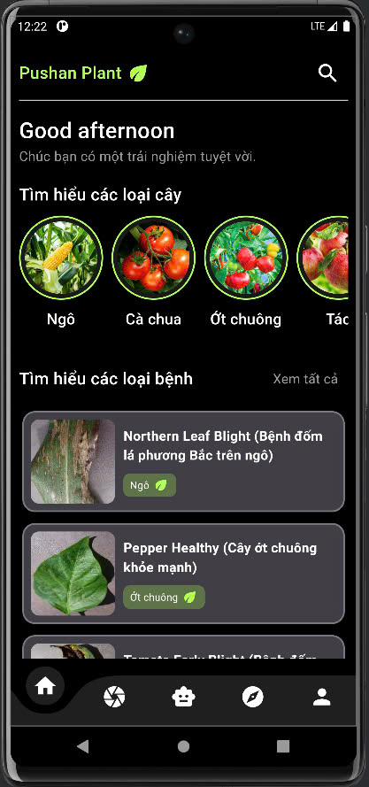
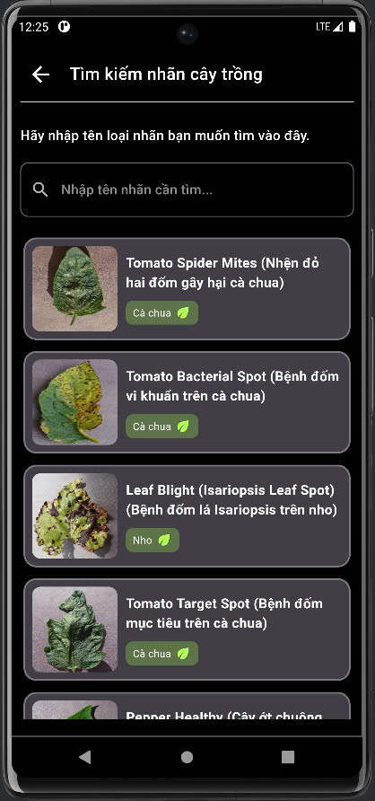
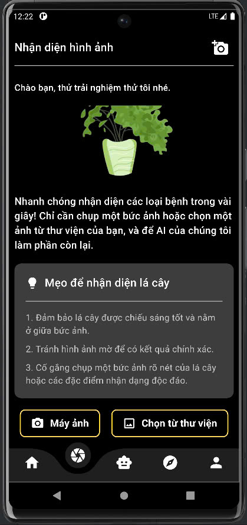
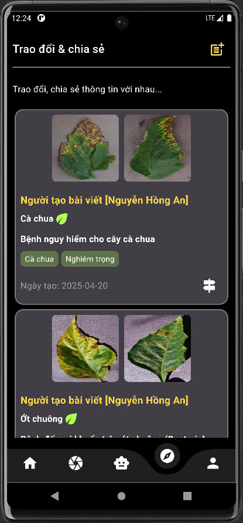
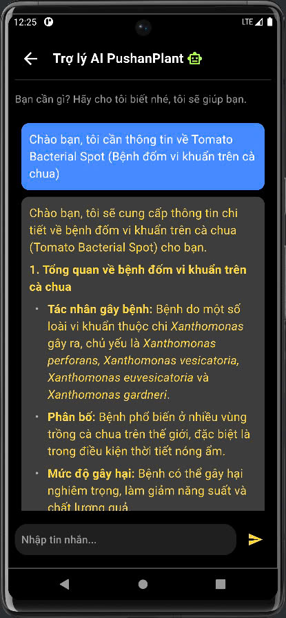
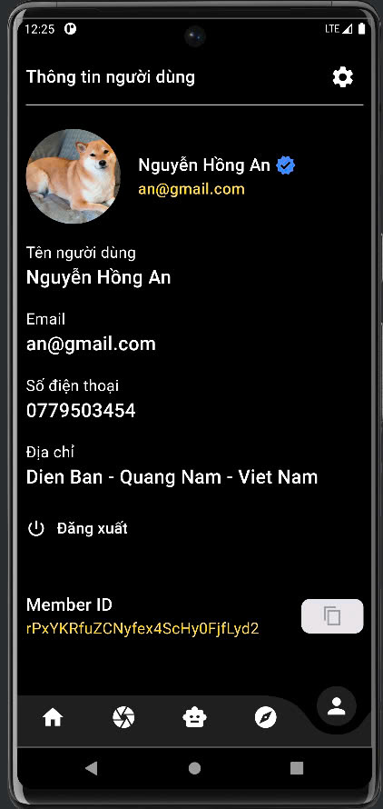
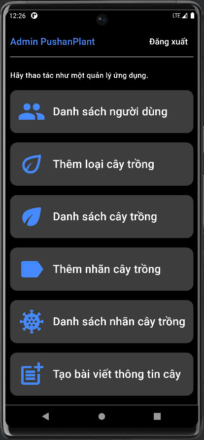
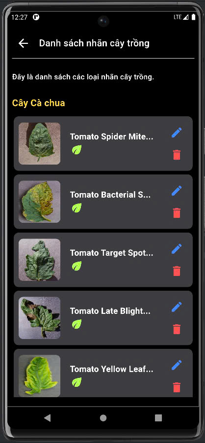

# 🌿 Pushan Plant App

A Flutter mobile application combined with a FastAPI model server to detect plant leaf diseases using a CNN model.  
Users can upload or capture leaf images, receive disease predictions, and chat with an AI assistant for treatment advice.

- **Status:** Work in progress  
- **Platform:** Android / iOS (Flutter)  
- **Frontend:** Flutter (Dart)  
- **Backend:** FastAPI (Python)  
- **Database & Auth:** Firebase

📌 Overview
---
Pushan Plant App helps users identify plant leaf diseases by analyzing images with a Convolutional Neural Network (CNN). The mobile app sends images to a FastAPI-based model server for inference and returns predictions with confidence scores. An AI chatbot (via GenMini API) assists users with recommended treatments and additional information. User data, posts, and disease metadata are managed using Firebase.

🎯 Key Features
---
- Capture or upload leaf images for disease detection  
- CNN-based prediction with a confidence score  
- AI chatbot for disease information & treatment suggestions (GenMini)  
- Feed / sharing area for plant health posts (user & admin)  
- User profile & settings  
- Search and browse disease catalog

🧱 Architecture
---
- Flutter mobile app (client)
- Firebase (Authentication, Firestore, Storage)
- FastAPI model server (image inference)
- GenMini API (chatbot)

Flow:
1. User selects or captures a leaf image in the app  
2. Image is sent to the FastAPI server (or uploaded to Firebase and URL sent)  
3. CNN model predicts disease label + confidence  
4. App displays the result and optional disease info  
5. User can ask the AI chatbot for more guidance

🛠 Tech Stack
---
- Frontend: Flutter (Dart)  
- Backend: FastAPI (Python)  
- Model: CNN (TensorFlow / Keras recommended)  
- Cloud: Firebase (Auth, Firestore, Storage)  
- Tools: Android Studio, Flutter SDK, uvicorn, Python virtualenv

📂 Repository Structure
---
- /app_flutter/     # Flutter mobile application  
- /server/          # FastAPI model server (Python)  
- /docs/            # Screenshots & design assets  
- README.md  
- LICENSE

▶️ Setup & Run (Quick)
---

Flutter (Client)
```bash
# from repository root or app_flutter/
flutter pub get
flutter analyze

# Run on connected device / emulator
flutter run

# Build release apk
flutter build apk --release
```
Notes:
- Add Firebase config files before running:
  - Android: android/app/google-services.json
  - iOS: ios/Runner/GoogleService-Info.plist
- Configure Firebase initialization in Flutter (firebase_core, firebase_auth, cloud_firestore, firebase_storage).
- Keep secret keys out of source code (use secure storage or server-side proxies).

Backend (FastAPI - Model Server)
```bash
# from server/
python -m venv venv
source venv/bin/activate      # macOS / Linux
venv\Scripts\activate.bat     # Windows

pip install -r requirements.txt

# Run FastAPI (development)
uvicorn app:app --reload --host 0.0.0.0 --port 8000
```
Typical endpoints:
- POST /predict — upload image (multipart/form-data) → returns JSON { label, confidence, info }  
- POST /chat — forward user message to GenMini (recommended to proxy via backend)  
- GET /health — health check

Example curl (predict)
```bash
curl -X POST "http://localhost:8000/predict" \
  -F "file=@/path/to/leaf.jpg"
```

🧠 Model
---
- Train a CNN offline (TensorFlow/Keras recommended) using labeled leaf images.  
- Save model in server/model/ (SavedModel or .h5).  
- Server loads model at startup and serves inference requests.  
- Include a label mapping file (e.g., labels.json) to translate model outputs to human-friendly disease names and descriptions.

Model tips:
- Use image augmentation, early stopping, and a validation split.  
- Consider model optimization (quantization or pruning) if you plan to run inference on resource-limited servers.

🔐 Firebase & API Keys
---
- Create a Firebase project and enable Auth, Firestore, and Storage.  
- Place platform config files in the Flutter project (google-services.json, GoogleService-Info.plist).  
- Store sensitive keys (GenMini API key) server-side as environment variables, e.g. GENMINI_API_KEY. Do not hardcode them in the Flutter app.

🖼 Screenshots / UI mockups
---
Place screenshots in /docs and reference them in README. Example HTML for central alignment in Markdown:

<p align="center">
  
  
  
</p>

<p align="center">
  
  
  
</p>

<p align="center">
  
  
</p>

📫 Contact
---
- GitHub: ancoldly
- Email: hongan.dev@gmail.com
